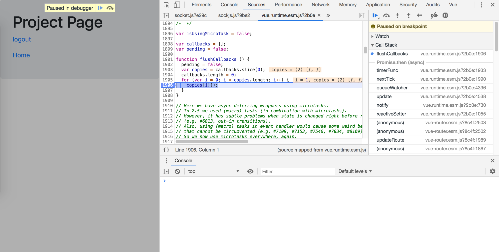

This project demonstrates a possible bug in the vue-router implementation.


Basically calling 
```next((vm) => {vm.$router.push("/error")});```

in the beforeRouteEnter hook. doesn't seem to abort the route but temporarily diplays it and then redirects to the desired route.


The discussion of the issue can be found in this forum post: 

https://forum.vuejs.org/t/beforerouteenter-behavior-within-chrome-debugger/61924

From this login page click the projects link which should not be reached because it requires user to be authenticated.


The page gets rendered


Then eventually the error page is loaded


